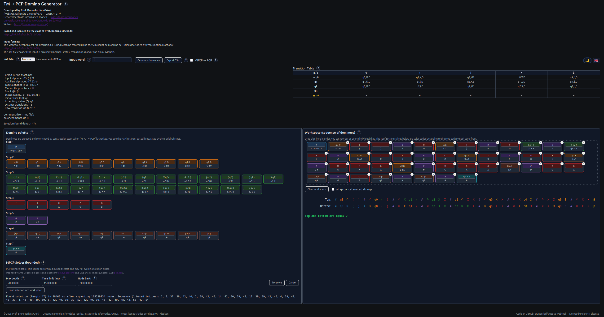

# tm2pcp-webtool

<p align="right">
  <strong>English</strong> |
  <a href="README.pt-BR.md">Português (Brasil)</a>
</p>


**tm2pcp-webtool** is an interactive, browser-based educational tool that demonstrates the classical reduction from the **Turing Machine Acceptance Problem** to the **Modified Post Correspondence Problem (MPCP)** and from **MPCP to PCP**.

The tool is designed for teaching **Theory of Computation**, allowing students to *see*, *manipulate*, and *simulate* the execution of a Turing Machine using dominoes.

🔗 **Live demo:** https://brunogrisci.github.io/tm2pcp

🔗 **GitHub repository:** https://github.com/brunogrisci/tm2pcp-webtool



---

## ✨ Features

### Core functionality
- Import a **Turing Machine** defined in the `.mt` format used by the  
  **Simulador de Máquina de Turing** (Prof. Rodrigo Machado).
- Automatic construction of the **MPCP domino set** encoding the TM execution.
- Optional transformation **MPCP ⇒ PCP**, following the classical reduction.
- Interactive **domino palette** and **workspace**:
  - Drag-and-drop dominoes
  - Double-click to append dominoes to the workspace
  - Remove individual dominoes
- Live visualization of the **concatenated Top and Bottom strings**, with:
  - Per-symbol color coding by construction step
  - Exact column alignment (supports multi-character symbols)
  - Toggle between line-wrapping or horizontal scrolling
- Visual **Transition Table** of the imported Turing Machine:
  - Marker symbol shown as the **first column**
  - Blank symbol shown as the **last column**
  - Highlighting of the relevant transition when a domino is selected


---

### MPCP / PCP support
- Toggle between **MPCP** and **PCP** views:
  - MPCP mode: first domino is fixed in the workspace
  - PCP mode: workspace starts empty
- Clear distinction between:
  - Raw transitions in the `.mt` file
  - Distinct transitions used by the machine
- Correct handling of multiple accepting states and implicit rejection


---

### Export & reproducibility
- **Export the currently displayed domino set** (MPCP or PCP) as a `.csv` file:

domino_id,top_string,bottom_string

- Supports offline analysis, assignments, and external PCP solvers.

---

### 🔍 (M)PCP Solver (bounded)

The tool includes a **bounded solver** for experimental exploration.

⚠️ **Important:**  
PCP is **undecidable**. This solver is **not** a decision procedure.

#### How the solver works

- Performs an incremental, prefix-based search
- Keeps only prefix-consistent sequences
- Expands sequences up to user-defined limits:
  - **Max depth**
  - **Time limit (ms)**
  - **Node limit**

The algorithm is inspired by:

- **Ling Zhao**, *Solving the Post Correspondence Problem*, PhD Thesis, Chapter 2.2  
- **Arne Vogel**, PCP solver and blog explanation

#### Solver controls

- **Try solve**: start the bounded search
- **Cancel**: interrupt the search
- **Load solution into workspace**: inspect a found solution

#### Why this does not contradict undecidability

- If the solver finds a solution → it is correct
- If it stops without finding one → no conclusion can be drawn

This behavior is **expected** and illustrates undecidability in practice.

---

### ❓ Integrated help system

Every major part of the interface includes a **“?” help button**, which opens an in-page explanation covering:

- theoretical background,
- formal definitions,
- GUI behavior,
- and how each component relates to the reduction.

Help content is:

- bilingual (English / Brazilian Portuguese),
- synchronized with dark mode,
- designed to be read independently by students.

---

### Usability & UI
- 🌙 / ☀️ **Dark mode toggle**
- 🇬🇧 / 🇧🇷 **Language toggle** (English & Brazilian Portuguese)
- Persistent preferences via `localStorage`
- Input word validation against the TM input alphabet (ε allowed)
- Clear status messages and error feedback
- Fully client-side (no backend)

---

## 📄 Input format

### `.mt` file
The tool accepts `.mt` files created using:

**Simulador de Máquina de Turing**  
Prof. Rodrigo Machado  
https://www.inf.ufrgs.br/~rma/simuladores/turing.html

The `.mt` file encodes:

- Input alphabet
- Auxiliary alphabet
- Tape alphabet
- Marker (start-of-tape) symbol
- Blank symbol
- States (with one initial state and zero or more accepting states)
- Transition matrix
- Optional comment block (displayed in the UI)

⚠️ Rejection is implicit: a configuration with no applicable transition and a non-accepting state is rejecting.

---

### Input word
- The input word is validated against the **input alphabet** of the TM.
- The **empty word (ε)** is always accepted as valid input.
- Multi-character symbols are supported.
- Invalid symbols are reported with precise feedback.

---

## 🧠 Pedagogical goals

This tool was built to help students:
- Understand the **operational meaning** of reductions
- Visualize how Turing Machine computations are encoded as PCP instances
- Explore the difference between MPCP and PCP
- Experiment interactively instead of relying only on static proofs

It is suitable for:
- Undergraduate courses in **Theory of Computation**
- Graduate-level formal language and computability courses
- Demonstrations, assignments, and interactive lectures

---

## 🌐 Internationalization (i18n)

- Full support for **English** and **Brazilian Portuguese**
- All UI strings, tooltips, and status messages are i18n-enabled
- Language switching does **not** reset the workspace or state

---

## 🛠️ Tech stack

- Vanilla **HTML / CSS / JavaScript**
- No external frameworks
- Fully client-side
- Designed to be hosted via **GitHub Pages**

---

## 🚀 Future work (ideas)

- Export domino sets as JSON
- Import previously exported domino sets
- Step-by-step guided construction mode
- Animated TM execution trace
- Support for additional TM file formats

---
## 🎓 Credits

**Developed by**  
**Prof. Bruno Iochins Grisci**  
Departamento de Informática Teórica  
Instituto de Informática – Universidade Federal do Rio Grande do Sul (UFRGS)  
🔗 https://brunogrisci.github.io/  
🔗 https://www.inf.ufrgs.br/site/  
🔗 https://www.ufrgs.br/site/

**Based on and inspired by**  
Classes by **Prof. Rodrigo Machado**  
📺 https://www.youtube.com/watch?v=u66FlodaBf4&list=PLLUEUvJhgJJCC76AYWdWH-GcOS2BogpEN&index=27

**Solver inspiration**:
  - Ling Zhao, *Solving the Post Correspondence Problem*, PhD Thesis, Ch. 2.2
  - Arne Vogel, PCP solver and blog post

**Development note**  
This webtool was created with the assistance of **Generative AI (ChatGPT 5.1)**.

---
## 📦 License

This project is licensed under the **MIT License**.

You are free to use, modify, and redistribute it for academic and educational purposes, provided proper attribution is given.

See the `LICENSE` file for details.

---

If you use this tool in teaching or research, a citation or link back to the repository is greatly appreciated.

## 📚 Citation

If you use this tool in academic work (papers, theses, technical reports, or teaching material), please cite it as:

```bibtex
@software{Grisci_tm2pcp_webtool,
  author       = {Bruno Iochins Grisci},
  title        = {{tm2pcp-webtool}: An Interactive Tool for Reductions from Turing Machines to (M)PCP},
  year         = {2025},
  url          = {https://github.com/brunogrisci/tm2pcp-webtool},
  note         = {Educational web-based software},
}
```

## 🔗 See also

- **PCP → CFG Ambiguity webtool**  
  Web app: https://brunogrisci.github.io/pcp2cfg  
  Repository: https://github.com/BrunoGrisci/pcp2cfg-webtool  
  This companion tool turns PCP domino sets into context-free grammars to explore ambiguity. Export your dominoes from tm2pcp as CSV and load them in pcp2cfg to continue the analysis on the resulting grammar and its ambiguous derivations.
